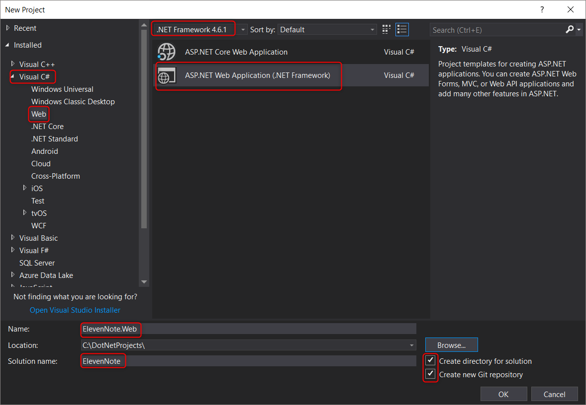
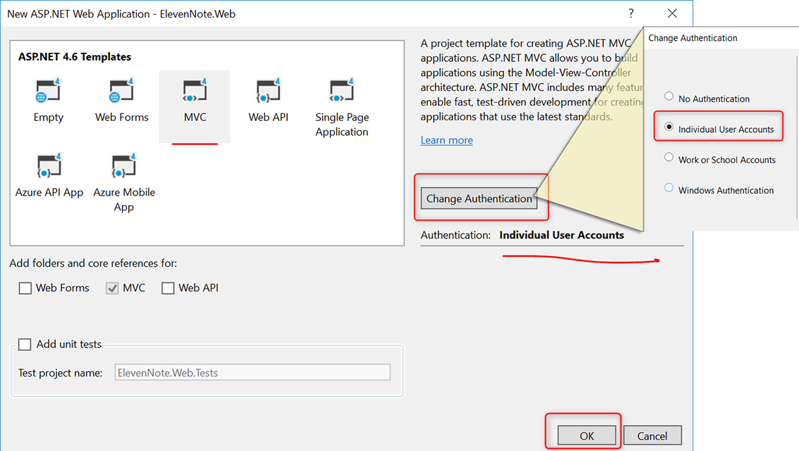

# PART 1: SOLUTION SETUP
---
In this module, we'll create our solution with the ElevenNote.WebMVC layer.

### Purpose
The purpose for this layer will be to establish one of the many possible views for our application, built from a .NET MVC Template project. Inside this assembly is a pre-built structure which can be used as scaffolding for our own views. In addition, we will harvest Microsoft's pre-constructed `IdentityModel.cs` file, and use it to create Individual Authentication. More on that later. Let's get started.

### Creating ElevenNote.WebMVC
1.  Open Visual Studio Community 2017.
2.  Select **File -> New -> Project**.
3.  In the bottom middle of the screen, make sure **.Net Framework 4.6.1** is selected. For older versions of VS Community, this option is in the top middle of the screen. (Note the screenshot below)
4.  On the left side, select **Visual C# -> Web**.
5.  In the middle of the screen, select **ASP.NET Web Application (.NET Framework)**. Maker sure it's NOT the `ASP>NET Core Web Application` for this project. 
6.  Fill in the input fields with the following data:
    - Project Name: **ElevenNote.Web**
    - Location: **Your Project Directory** 
    - Solution Name: **ElevenNote**
    - Check **Create Directory for Solution**
    - Check **Create new Git repository**
    - Click **OK**
    
*The solution (overall folder) is named **_ElevenNote_**, this first project is named **_ElevenNote.Web_**. There will be other projects within this solution.*
7. Select **MVC**.
8. Click **Change Authentication**.
9. Select **Individual User Accounts** and click **OK**.
Make sure everything is ok:

10. Click **OK** to create the project.
