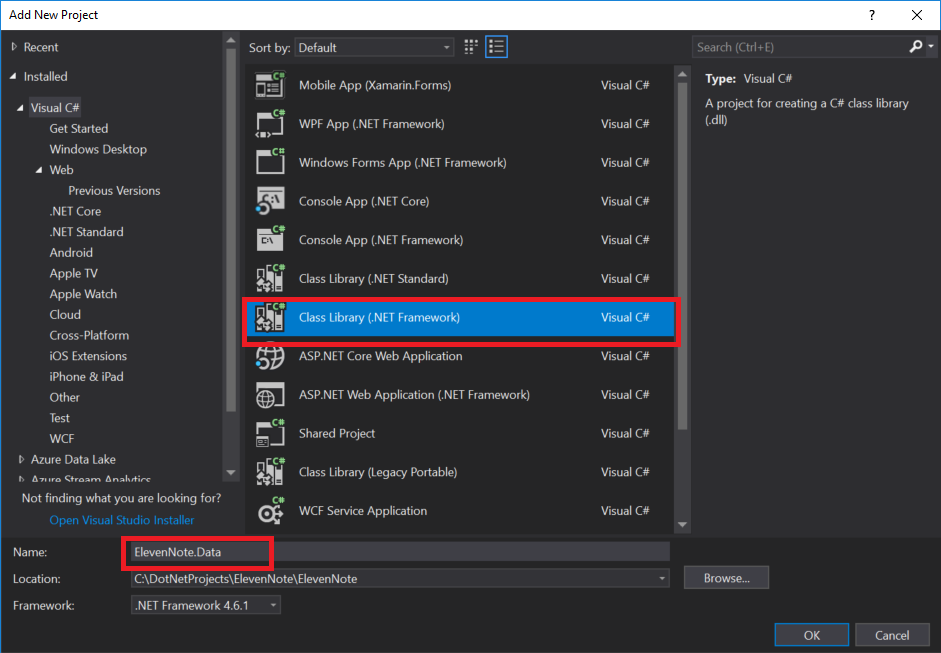

# PART 2: ELEVENNOTE.DATA
---
In this module, we'll create our solution with our ElevenNote.Data layer.

### Purpose
This layer will be used to house the information about our Data Entities.  These entities will match the data tables in our project. Later on, we will also add authentication data to this layer. 

### Steps
Let's add the assembly for this layer now:

1. In the **Solution Explorer**, right click on the **ElevenNote** Solution
   - *Make sure to right click on the **Solution** and NOT the project **ElevenNote.WebMVC***
2. Go to **Add -> New Project**

3. Select **Visual C#**, then **Windows Classic Desktop**
4. Choose **Class Library**
5. Name the project **ElevenNote.Data**

6. In the **ElevenNote.Data** project, right click on `Class1.cs` and delete it. Some people might be able to hit ctrl + x. 
5. We'll leave this project empty for now.
