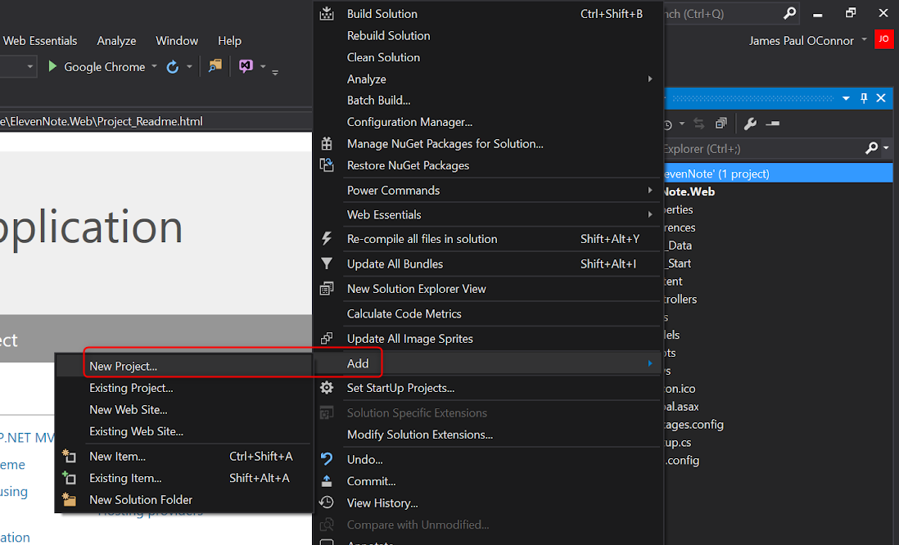

# PART 2: ElevenNote.Data
---
In this module, we'll create our solution with our ElevenNote.Models layer.

### ElevenNote.Data
This layer will be used to house the models for our application. These models will be classes used to create instances throughout in almost all layers of our application. 

### Steps
1. In the **Solution Explorer**, right click on the **ElevenNote** Solution
   - *Make sure to right click on the **Solution** and NOT the project **ElevenNote.Models***
2. Go to **Add -> New Project**

3. Select **Visual C#**, then **Windows Classic Desktop**
4. Choose **Class Library**
5. Name the project **ElevenNote.Models**

6. In the **ElevenNote.Models** project, right click on `Class1.cs` and delete it. Some people might be able to hit ctrl + x. 
5. We'll leave this project empty for now.
