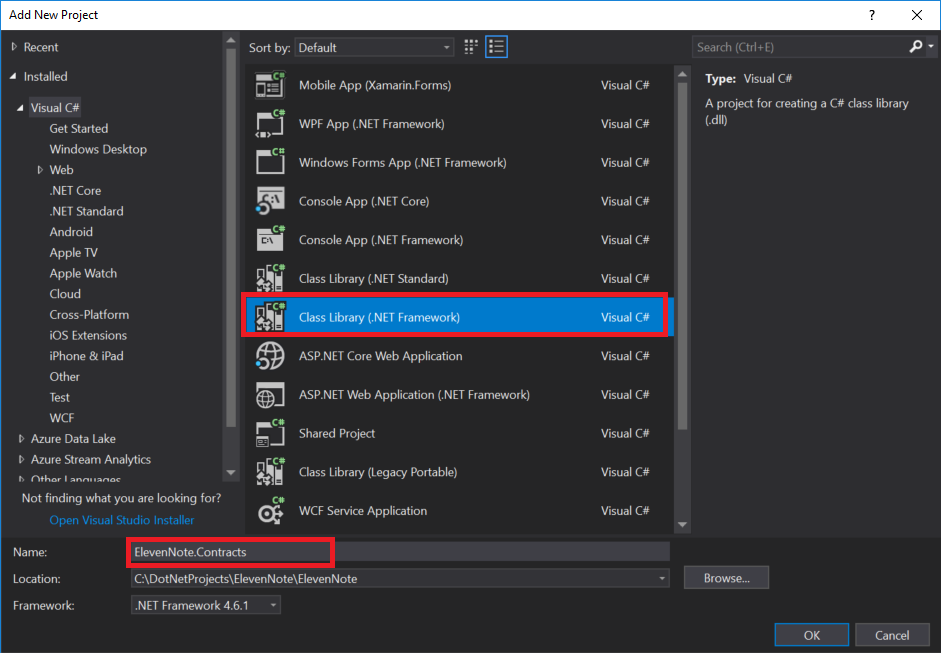

# 1.3: ElevenNote.Contracts
---
In this module we'll set up our ElevenNote.Contracts assembly.

### Purpose
The purpose of this layer will be to house our Interfaces, which will serve as contracts for our application's methods.

### ElevenNote.Contracts
1. In the **Solution Explorer**, right click on the **ElevenNote** Solution
   - *Make sure to right click on the **Solution** and NOT the project **ElevenNote.WebMVC***
2. Go to **Add -> New Project**

3. Select **Visual C#**, then **Windows Classic Desktop**
4. Choose **Class Library**
5. Name the project **ElevenNote.Contracts**

6. In the **ElevenNote.Contracts** project, right click on `Class1.cs` and delete it.