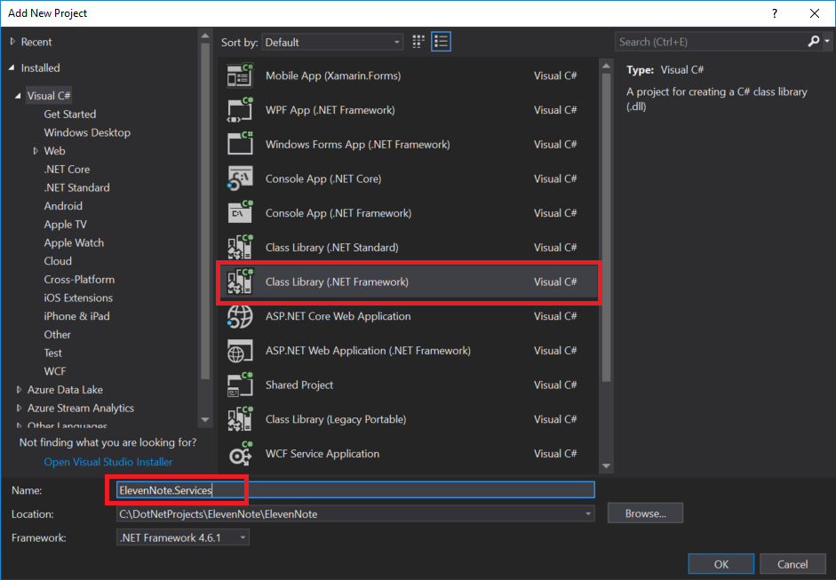

# 1.4: ElevenNote.Services
---
In this module we'll add our ElevenNote.Services layer.

### Purpose
The purpose of our service layer will be to house our logic for using Entity Framework to interact with our database. Our services will be used by our WebApi and our MVC app to do the heavy lifting for our database CRUD operations.   

### Set up
1. In the **Solution Explorer**, right click on the **ElevenNote** Solution
   - *Make sure to right click on the **Solution** and NOT the project **ElevenNote.WebMVC***
2. Go to **Add -> New Project**

3. Select **Visual C#**, then **Windows Classic Desktop**
4. Choose **Class Library**
5. Name the project **ElevenNote.Services**

6. In the **ElevenNote.Services** project, right click on `Class1.cs` and delete it
