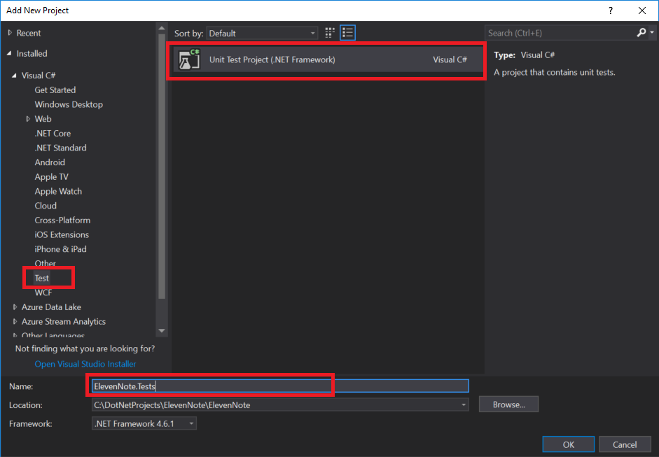

# 1.5: ElevenNote.Tests
---
In this module we'll set up a Unit Tests project.

### Purpose
The purpose of our unit testing project will be to write code that tests code. 

### ElevenNote.Services
1. In the **Solution Explorer**, right click on the **ElevenNote** Solution
   - *Make sure to right click on the **Solution** and NOT the project **ElevenNote.Web***
2. Go to **Add -> New Project**

3. Select **Visual C#**, then **Windows Classic Desktop**
4. Choose **Class Library**
5. Name the project **ElevenNote.Tests**

6. In the **ElevenNote.Tests** project, right click on `Class1.cs` and delete it.
