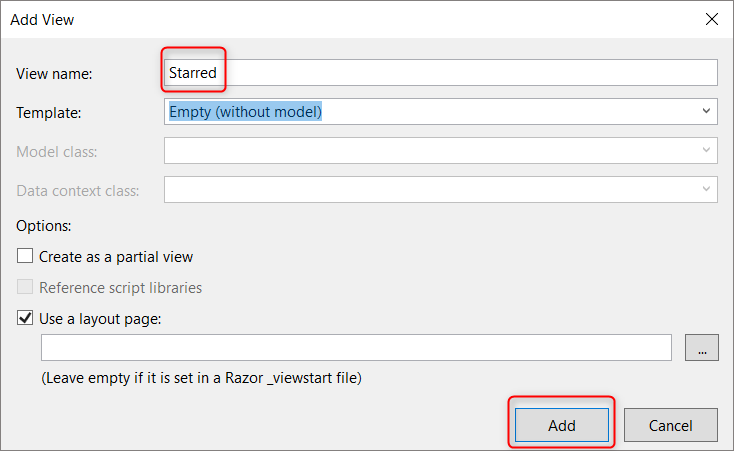

# PART 12: ADD A STAR OPTION
---
### Add `isStarred` Property to Database
Let's add an option to star a note.  This is an example of how to make changes after you've completed the first version of something. It's a good idea to branch off and do this on a separate branch.

First, we need to update our database to have a property of wether or not a note is starred.

1. Go to **ElevenNote.Data -> Note.cs**
2. Add the following property between the `Content` and `CreatedUtc` properties
    ```cs
        [DefaultValue(false)]
        public bool IsStarred { get; set; }
    ```
3. `CTRL .` to bring in the using statement
4. 
5. In order for the database to be updated with this new column, we need to:

    ####[RUN MIGRATIONS](../3-DatabaseSetup/3.0b-Migrations.md)

### Update the `NoteListItem` Model
We'll want a clickable star on the page that shows all of our notes. The model for that view is `NoteListItem`

1. Go to **ElevenNote.Models -> NoteListItem.cs** and add the `IsStarred` property between the `Title` and `CreatedUtc`
    ```cs
        [UIHint("Starred")]
        public bool IsStarred { get; set; }
    ```
2. The `UIHint` will link up to a view we make later
3. 

### Update `NoteService.cs`
We'll need the service to know about the star as well???

1. Add the `IsStarred` option in  `IEnumerable<NoteListItem>`  and 
    ```cs
        new NoteListItem
    {
        NoteId = e.NoteId,
        Title = e.Title,
        IsStarred = e.IsStarred,
        CreatedUtc = e.CreatedUtc
    }
    ```

### Add Star to Index View
We need to add a column and column name for the `isStarred` property in our table that displays the list of notes.

1. Open **ElevenNote.Web -> Views -> Note -> Index.cshtml**
2. Add the `DisplayNameFor` for `IsStarred`
    ```html
        <th>
            @Html.DisplayNameFor(model => model.Title)
        </th>
        <th>
            @Html.DisplayNameFor(model => model.IsStarred)
        </th>
        <th>
            @Html.DisplayNameFor(model => model.CreatedUtc)
        </th>
        <th></th>
    </tr>
    ```
3. Add the `DisplayFor` for `IsStarred`
    ```html
        <td>
            @Html.DisplayFor(modelItem => item.Title)
        </td>
        <td>
            @Html.DisplayFor(modelItem => item.IsStarred, new { Id = item.NoteId })
        </td>
        <td>
            @Html.DisplayFor(modelItem => item.CreatedUtc)
        </td>
        <td>
            @Html.ActionLink("Edit", "Edit", new { id = item.NoteId }) |
            @Html.ActionLink("Details", "Details", new { id = item.NoteId }) |
            @Html.ActionLink("Delete", "Delete", new { id = item.NoteId })
        </td>
    </tr>
    ```
4. Now, we need some JavaScript to make the star functionality work
5. Add this code to the very end of `Index.cshtml`, after `</table>`:
    ```html
    @section scripts {
    <script language="javascript" type="text/javascript">
        $(document).ready(function () {
            $("i[data-toggle='star']")
                .css({ "cursor": "pointer" })
                .click(function (e) {
                    var target = $(e.target);
                    var noteId = target.attr("data-id");
                    var starSet = target.hasClass("glyphicon-star");

                    $.ajax({
                        method: starSet ? "DELETE" : "PUT",
                        url: "/api/note/" + noteId + "/star",
                        data: null
                    })
                    .done(function (r) {
                        target.removeClass();
                        target.addClass("glyphicon " + (starSet ? "glyphicon-star-empty" : "glyphicon-star"));
                    })
                    .fail(function (r) {
                        alert("Failed to change star status");
                    });
                });
        });
    </script>
}
    ```
5. 

### Add the Starred Display Template
Similar to the DateTime display changes we made, we'll make a view specifically for the star. Notice that the name of this view, `Starred`, is the same as the `UIHint` from the `NoteListItem` model.

1. Right click on the **ElevenNote.Web -> Views -> Shared -> Display Templates** folder and select **Add -> View**
2. Name it `Starred` and fill it out like this:

3. Add this code:
    ```html
    @model bool

    <span>
        <i class="glyphicon @(Model ? "glyphicon-star" : "glyphicon-star-empty")"
           data-toggle="star"
           data-id="@ViewBag.Id"></i>
    </span>
    ```
4. 

[Next,](12.1-StarSetup.md) we'll do more setup to get the star function working. 

