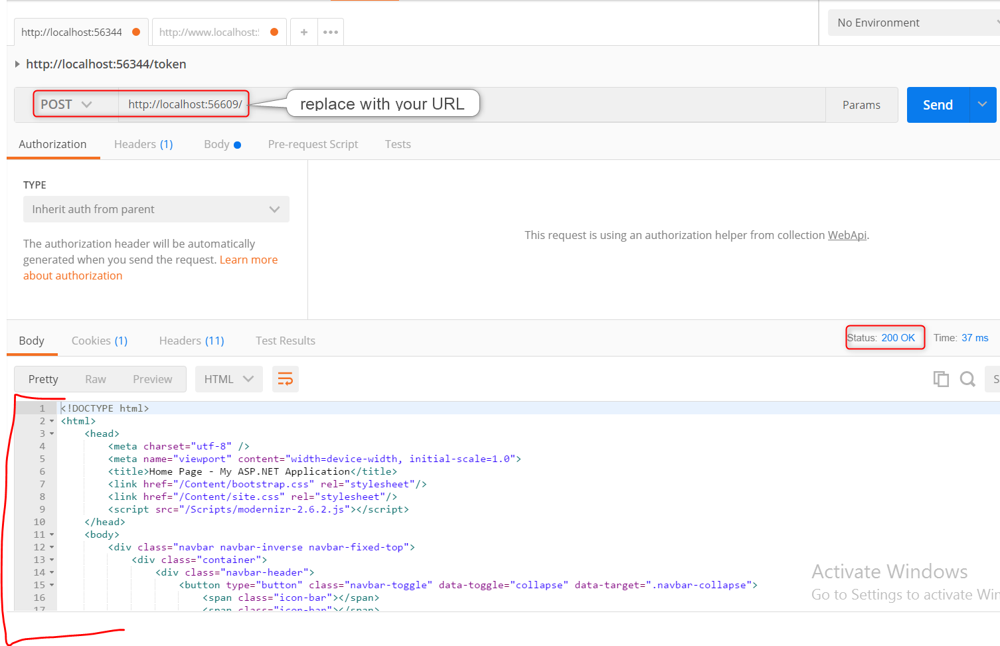
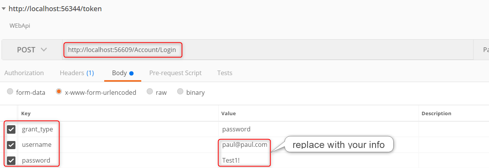
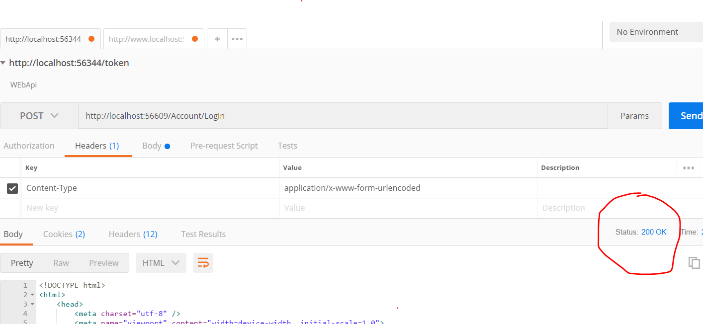

# 13.1: TEST LOGIN WITH POSTMAN
---
In this section, we begin Postman testing with the login page.
### Test the URL
You may want to work on another branch

1. Make sure **ElevenNote.Web** is still the startup project
2. Run the app and log off if you're logged in
3. Copy the URL **localhost:XXXXX**
   * XXXXX stands for whatever number your port is in the address bar
4. Open Postman
5. Close the window that comes up
5. Paste the URL, set the request to **POST** and press **Send**


### Test the Login URL
1. Login in to your ElevenNote app
2. Back in Postman, add **/Account/Login** to the URL and make sure the request is set to **POST**
3. Click on the **Body** tab, select **x-www-form-urlencoded**, and add the three key/value pairs as shown below:

4. You should get a *500 Internal Server* error. Error codes are explained in [section 19.](../19-ApiTips/19.0-PostManTips.md)

5. Looking at the response, it seems we need a token to log in.
6. Stop the app

### Test the `[ValidateAntiForgeryToken]`
1. Open **ElevenNote.Web -> Controllers -> AccountController**
2. Comment out `[ValidateAntiForgeryToken]` above the login method
3. This is temporary, we'll change it back

    ```cs
    [HttpPost]
    [AllowAnonymous]
    //[ValidateAntiForgeryToken]
    public async Task<ActionResult> Login(LoginViewModel model, string returnUrl)
    {
        if (!ModelState.IsValid)
    }
    ```
4. Run the app and login
5. Go to Postman and hit **Send** again with the same request
6. You should get *200 OK*

7. **DO THIS IMMEDIATELY:** Stop the app
8. Un-comment `[ValidateAntiForgeryToken]`, restart the app, and login.
9. Retest in Postman, you should get the *500* error again.
10. Stop the app

[Next,](13.2-SSL.md) we'll add SSL for release builds.