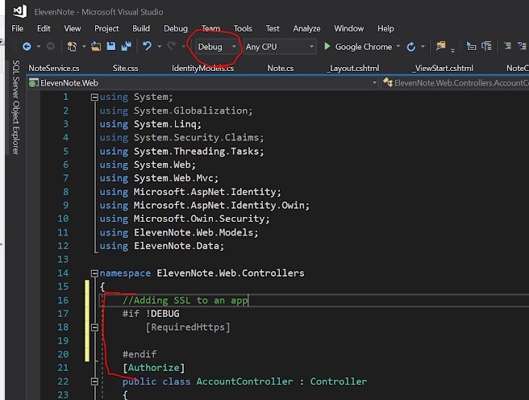

# 13.2: SSL
---
### Add SSL for Release Builds
SSL (Secure Sockets Layer) is something about encryption and using https instead of http so the site is more secure? Here we will set the app up to require https unless we are in debug mode.

1. Open **ElevenNote.Web -> Controllers -> AccountController**
2. Add this annotation above the routes and 

    ```cs
    namespace ElevenNote.Web.Controllers
    {

    #if !DEBUG
        [RequireHttps]
    
    #endif
    [Authorize]
    public class AccountController : Controller
    ```
3. Change the tab from **Debug** to **Release**. Notice the code is commented/un-commented depending on the setting.


4. Set the drop-down back to **Debug** and 

[Next,](../14-WebAPI/14.0-WebAPISetup.md) we'll set up the WebAPI project.
