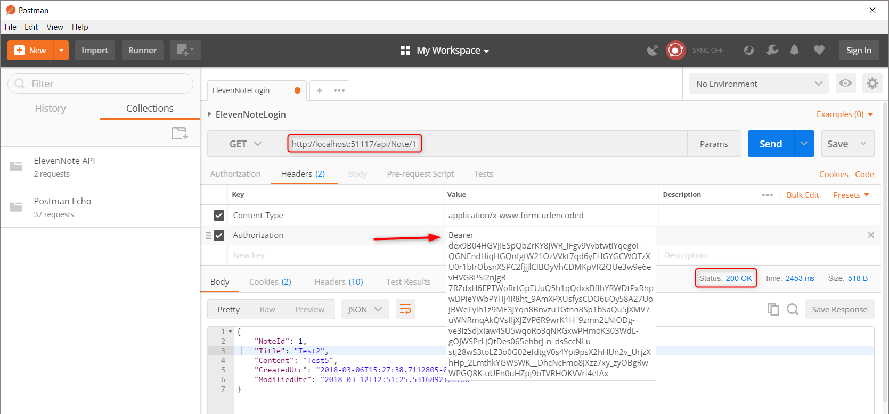

# 17.1: TESTING `GetNoteById`
---
### Test the `GetNoteById` method
In this section, we will test the endpoint that **gets** a specific note by id.

1. Make sure your API is running and open Postman
2. Add the API endpoint to the end of the URL **api/Note/1**
   * *The # at the end must be the id of a note that is in the database for the specific user*
3. Choose **GET**
4. We also need our token
   * Remember that Http is stateless, the server does not remember our last request
   * We need the token as a kind of hand stamp to let us have authenticated access
5. Make sure you have a token copied after the word **Bearer** in the values column

6. Click **Send** and you should get **200 OK** 

[Next,](17.2-PostTest.md) we'll test the `Post` method.