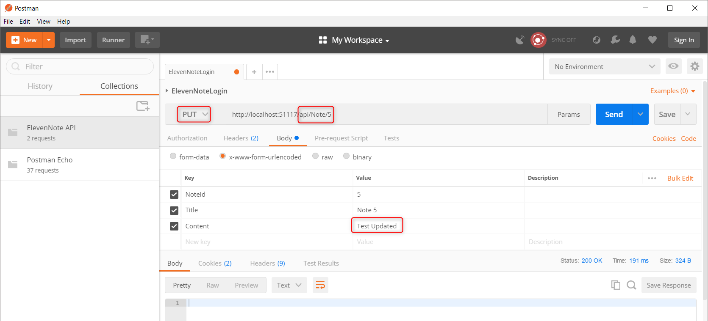
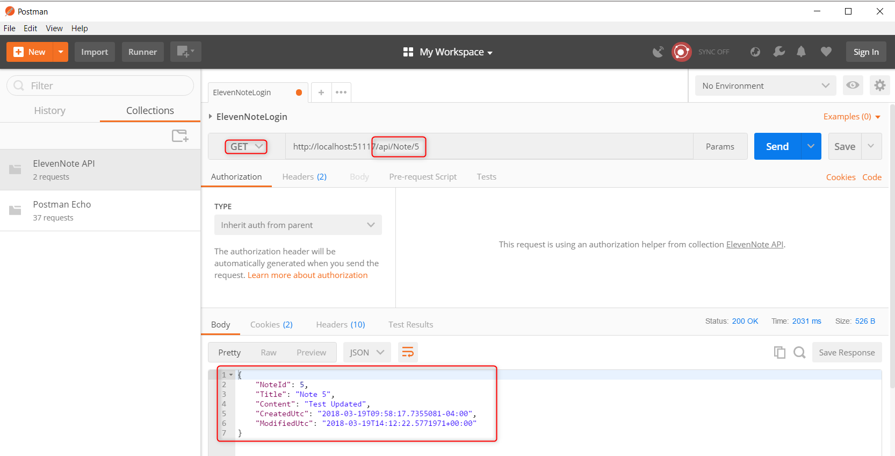

# 17.3: TESTING `Update`
---
### Test the `Update` Method
Next, we'll test the ability to **edit** a note.

1. We can use the same request to test the `Update` method, with a few modifications.
2. Change **GET** to **PUT**
3. Change the content or title of the note.
4. Press **Send** and you should see **200 OK**

5. You can test this by changing to **GET** and checking the content you get back in the body.

[Next,](17.4-DeleteTest.md) we'll test the `Delete` method.