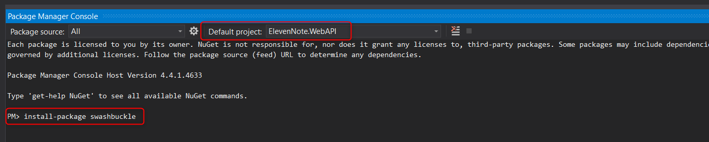

# PART 18: SWAGGER
---
### Install and Setup Swagger
In this section, we set up **Swagger**, a tool that allows us to visualize all the endpoints of our API and easily test them.

1. In Visual Studio, go to **Tools -> NuGet Package Manager -> Package Manager Console**
2. Make sure **ElevenNote.WebAPI** is set as the default project
3. Type `install-package swashbuckle`
   * Triple check that your default project is **ElevenNote.WebAPI** before you hit enter, my selection kept jumping to **Models**
   * Hit *Enter*

4. When it's finished installing, close the **Package Manager Console**
5. Go to **ElevenNote.WebAPI -> App_Start -> SwaggerConfig.cs**
6. Replace the entire contents of the file with this [code](18.0a-SwaggerConfig.md).
7.  & 

[Next,](18.1-TestWithSwagger.md) we'll test endpoints in Swagger.

