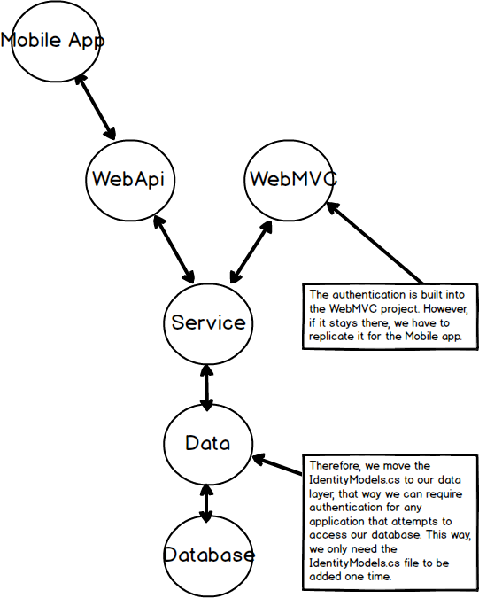
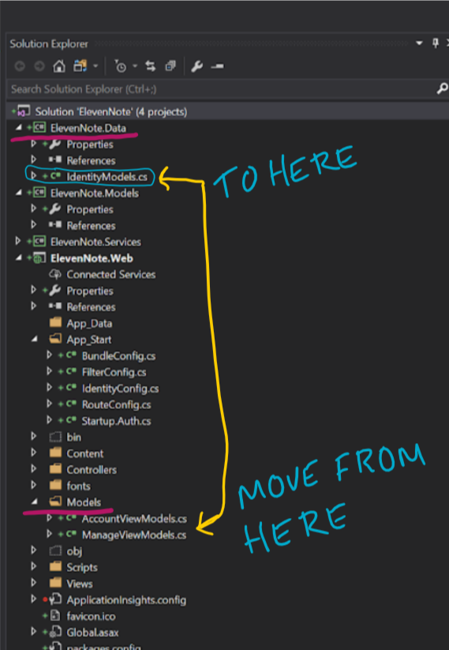

# IDENTITY MODEL
---
In this module we'll address the placement of the IdentityModels that will be used for authentication later on. 

### Purpose
To make the `IdentityModels.cs` more accessible, we will move it from the **web** project to the **data** project. The Identity Models are provided to us by Microsoft and allow us to provide authentication. Consider the following diagram:

 
### Steps

1. Go into the **ElevenNote.WebMVC** project.
2. Go into the **Models** directory.
3. Click on `IdentityModels.cs`.
4. Press `ctrl + c` to copy the file(or right click and copy). 
5. Delete the file after that.
6. Right click on **ElevenNote.Data** and paste the `IdentityModels.cs` file into the project.

7. In the `IdentityModels.cs` file, change the namespace to **ElevenNote.Data**.
