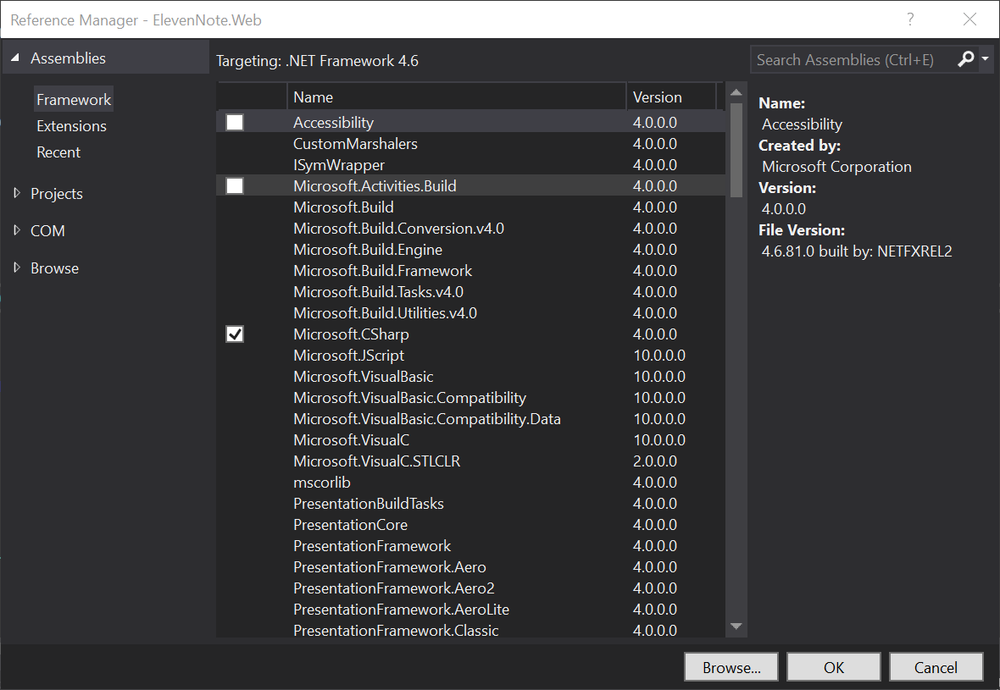

# 2.1a: REFERENCES
---
### Notes on the tabs
- Assemblies are globally available items that can be included in your project.
- Projects are your projects.
- COM is an older legacy language that is not used as much now.
- Browse is the way to browse to a folder containing a separate assembly

[Back](2.1-EntityRefrencesAndUsingStatements.md) to 2.1

