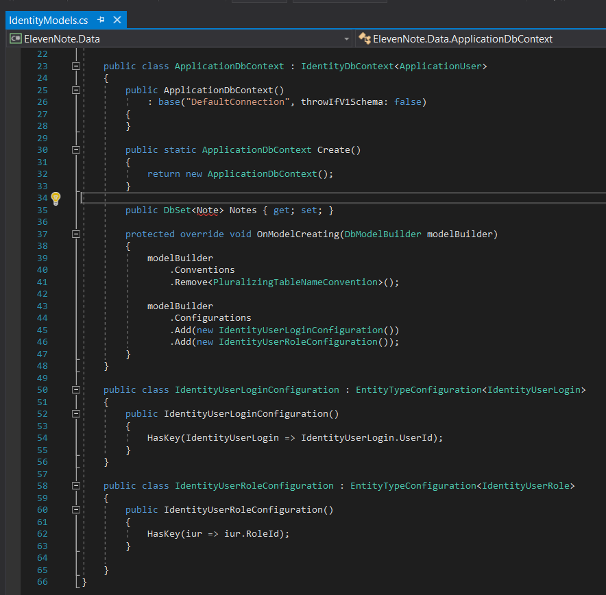
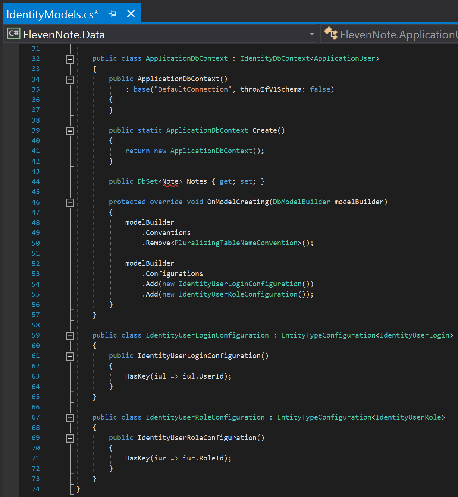

# 2.2: IDENTITY MODELS SETUP
---
### Identity Model
1. In the **ElevenNote.Data** assembly, open the `IdentityModels.cs` file. Please note that we will be adding a lot of code in the next few steps. (2.2a-IdentityModelsScreenshot.md) Refer to this screenshot to see it all in context:


*You will have an error on `<Note>` until the beginning of part 3, don't worry about it for now.*

2. Look for the `ApplicationDbContext` function.
3. Underneath the function, but still inside the namespace, create the following `IdentityUserLoginConfiguration` class and method. This code will go right above the closing curly brace for the file:

```cs
    public class IdentityUserLoginConfiguration : EntityTypeConfiguration<IdentityUserLogin>
    {
        public IdentityUserLoginConfiguration()
        {
            HasKey(iul => iul.UserId);
        }
    }

} //<----Closing curly brace of file
```
4. `CTRL .` to bring in the using statement needed: `using System.Data.Entity.ModelConfiguration;`

5. Now create an `IdentityUserRoleConfiguration` class underneath the class you just created

```cs
    public class IdentityUserRoleConfiguration : EntityTypeConfiguration<IdentityUserRole>
    {

    }
}//<----Closing curly brace of file
```
6. In this class, add the following method

```cs
    public class IdentityUserRoleConfiguration : EntityTypeConfiguration<IdentityUserRole>
    {
        public IdentityUserRoleConfiguration()
        {
            HasKey(iur => iur.RoleId);
        }
    }
}//<----Closing curly brace of file
```
7. Go back up under the `Create()` method that is within the `ApplicationDbContext` class
8. Underneath the `Create()` method, but still within the `ApplicationDbContext` class, add a `Notes` property

    ```cs
        public static ApplicationDbContext Create()
        {
            return new ApplicationDbContext();
        }

        public DbSet<Note> Notes { get; set; } //<--- Add this

    }
    ```
   * *You will have an error on `<Note>` until the beginning of part 3, don't worry about it for now.*
9. Directly underneath the `Notes` property, but still within the `ApplicationDbContext` class, type **override** and then a space.
10. Auto-complete should provide you with choices, choose `OnModelCreating` and hit enter.
11. Delete the `base.OnModelCreating(modelBuilder);` and replace it with the following:

```cs
    protected override void OnModelCreating(DbModelBuilder modelBuilder)
    {
        modelBuilder
            .Conventions
            .Remove<PluralizingTableNameConvention>();
    
        modelBuilder
            .Configurations
            .Add(new IdentityUserLoginConfiguration())
            .Add(new IdentityUserRoleConfiguration());
    }
}
```
12. `CTRL .` to bring in the using statement needed
13.  & 

#### Notes:
Here is all of the code we have added for context:



[Next,](../3-DatabaseSetup/3.0-Data.md) we'll create the Note entity for our database.