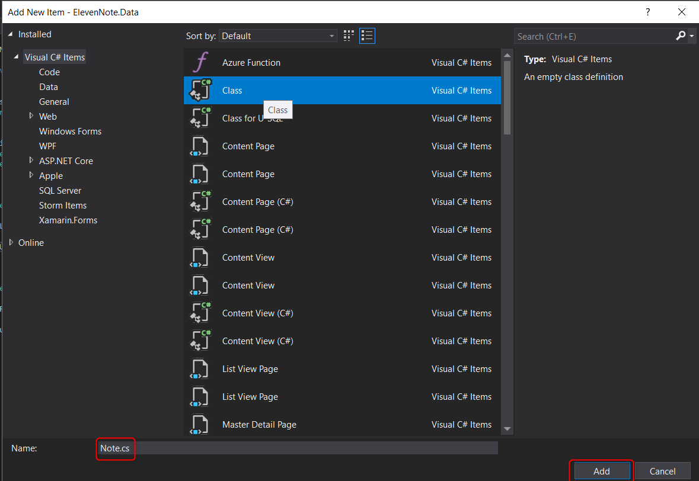
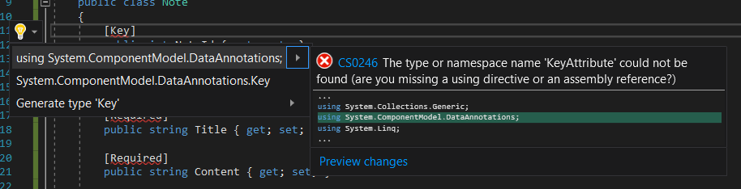

# PART 3: DATABASE SETUP
---
In this model will we set up our Note.cs class.

### 3.0: Entity Model
The entity model represents how we will set up data in our database. The properties we add to this class will be added as columns in our SQL table. These items will also be used by the service layers to persist data and query the database. More on that later. 

1. In the **Solution Explorer**, right click on **ElevenNote.Data**.
2. Select **Add -> Class** and name it `Note.cs`.

3. Make this class public. This will make it accessible to other assemblies. 
4. Add the properties inside of class:
```cs
namespace ElevenNote.Data
{
    public class Note
    {
        public int NoteId { get; set; }
        public Guid OwnerId { get; set; }
        public string Title { get; set; }
        public string Content { get; set; }

        public DateTimeOffset CreatedUtc { get; set; }

        public DateTimeOffset? ModifiedUtc { get; set; }
    }
}
```
5. Add data annotations - we'll see [more info](3.0a-Annotations.md) about data annotations in the next module.

```cs
namespace ElevenNote.Data
{
    public class Note
    {
        [Key]
        public int NoteId { get; set; }

        [Required]
        public Guid OwnerId { get; set; }

        [Required]
        public string Title { get; set; }

        [Required]
        public string Content { get; set; }

        [Required]
        public DateTimeOffset CreatedUtc { get; set; }

        public DateTimeOffset? ModifiedUtc { get; set; }
    }
}
```
6. `CTRL .` to bring in the using statement for the annotations

7. 

#### Important: 

- Notice the `?` after the `DateTimeOffset` for the `ModifiedUtc`. This allows it to be null.  Click [here](3.0d-Types.md) for information about DateTimeOffset and reference vs value types.

