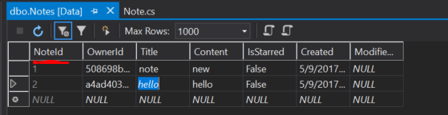

# 3.0a: DATA ANNOTATIONS
---   
In this module we'll discuss Data Annotations.

<hr />

### Key Attribute
In `Note.cs` we added a `[key]` attribute. This attribute specifies the property that **uniquely** identifies an entity.  In other words, it's the **primary key** of the corresponding database. To peek ahead, here's what you'll see:


<hr />

### Key Attribute Example
Let's still examine this key:

```cs
public class Order
{
    [Key]
    public int NoteId { get; set; }
}
```
A single user could have multiple notes, or different users could add a note at the same time, so we need some sort of property that returns a **unique** note number. In other words the primary key will always be a unique number.

### Validation Attributes
There are a few attributes we can use to **validate** our models. The `[Required]` attribute ensures the user does not enter a **null** value.  The `[Range]` attribute ensures the user provides a value within the specified range. Attributes such as `[MaxLength]` limit the amount of characters users can provide.

Here are a few examples of attributes that could be added to a property:
```cs
[Required]
[Range(1,5, ErrorMessage="please choose a number between 1 and 5")]
[MaxLength(100, ErrorMessage = "There are too many characters in this field.")]
```

### Display Attribute
Use the `[Display]` or `[Display(Name)]` attribute to change the name the user is shown for a property.

### Display Attribute Example
```cs
[Display(Name = "Note was Created")]
```

