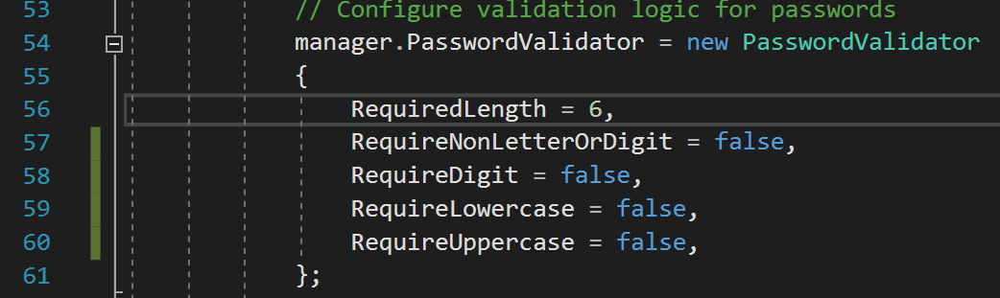

# 3.5 PASSWORD INFORMATION
---
In this module we will adjust password requirements so that it is easier to test the app and create test users.

### Steps
1. In the **ElevenNote.WebMVC** assembly, go to **App_Start -> IdentityConfig.cs**.
2. The `PasswordValidator` variable declaration is on line 54.
3. Set the booleans to false and  the file.
   - This way you can use simpler passwords while developing
   - The required length is always at least 6, but feel free to change it to 4 during development.

