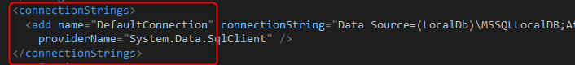
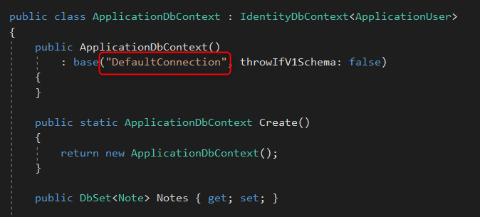
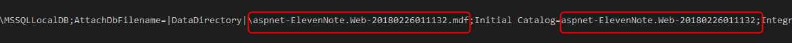
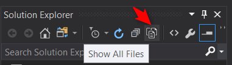
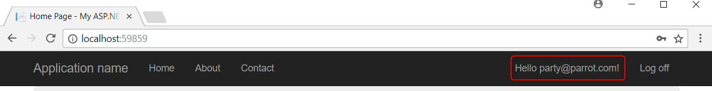
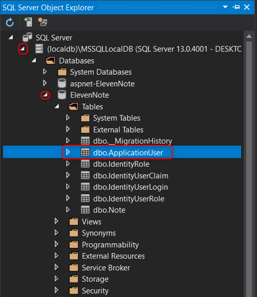
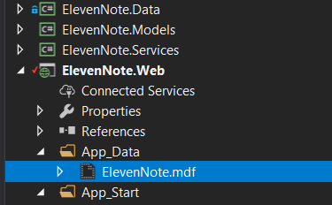
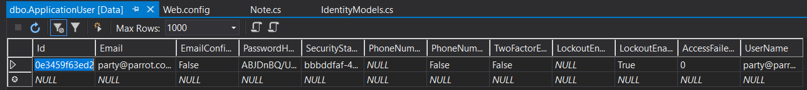
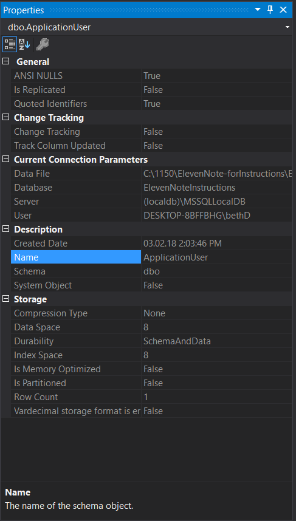

# 3.1: DATABASE AND CONNECTION STRING
---

### Connection String
1. In **ElevenNote.Web**, open the `Web.Config` file
2. Look at the `<connectionStrings>`
3. Notice the the name is `"DefaultConnection"`

4. Go to **ElevenNote.Data ->** `IdentityModels.cs`
5. In the `ApplicationDbContext` method, one of the arguments is `"DefaultConnection"`

6. This is how the application can communicate with the configuration file and persist application data
7. Go back to **ElevenNote.Web ->** `Web.Config`
8. In the connection string, the name of the database is in two places.  Change both to remove the aspnet at the beginning and the numbers at the end

9. 
10. Make sure you've run [migrations](3.0b-Migrations.md)
10. Run the application and register an account
11. Make sure to remember the login/password you use to test with later
12. In the top right of the application, you should be greeted with the email you entered

13. Go to the **Solution Explorer**
14. Go to **ElevenNote.Web -> App_Data**
15. Click the **Show all Files** button to see where the mdf file is stored

### Database
1. In the **Quick Launch** (top right), type in 'SQL'
2. Find the **SQL Serve Object Explorer** (you can also get this by going to **View -> SQL Server Object Explorer**)
3. Find your database and expand the **Tables** folder
4. Right click on `dbo.ApplicationUser` and select **View Data**

5. Checkout the data

6. Close the data tab
6. Right click on `dbo.ApplicationUser` and select **Properties**
7. Take a look at the table's properties

8. 

[Next,](../4-NoteListItem/4.0-NoteController.md) we'll create the NoteController.

