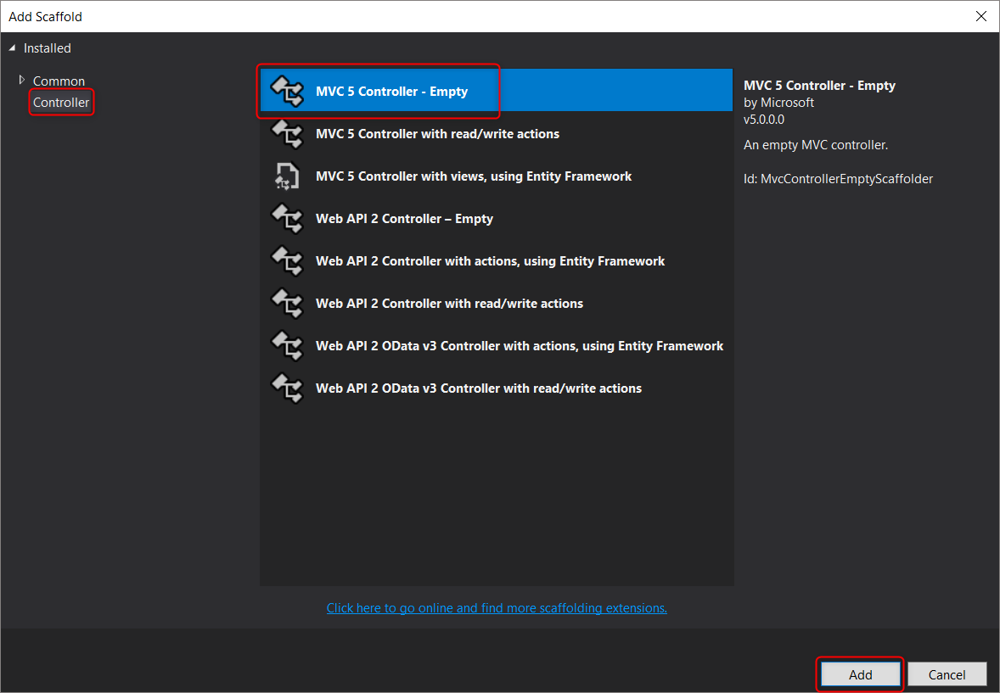
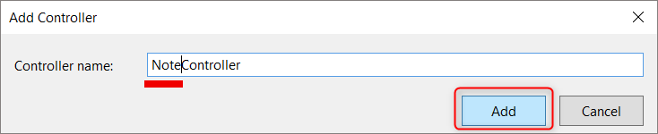
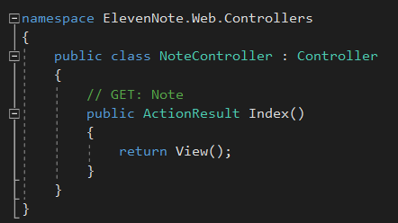
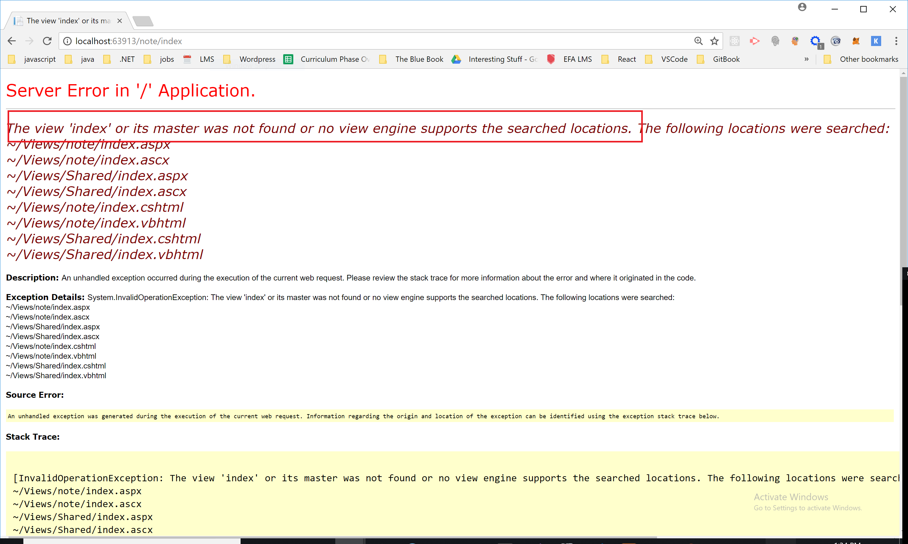
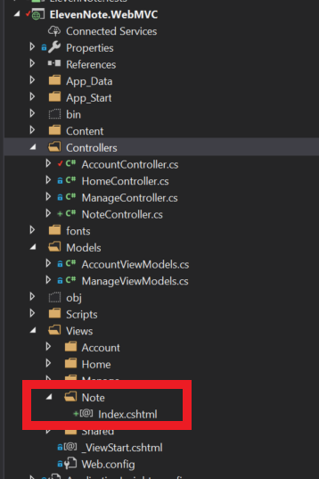

# PART 4: `NoteController`
---
In the next few modules we'll set up our .WebMVC project using the MVC pattern. 

<hr />

### Purpose
We are going to create a NoteController. Then, we are going to add all of our CRUD operations in the NoteController. The NoteController will manage views for Creating, Reading, Updating, and Deleting notes for a user. It will allow for full CRUD operations in the application, and it will also handle listing out all notes by user. For all of these notes views, we will only need to have one controller file, which we will call the NoteController. Let's get started.

### Steps
1. Go to **ElevenNote.WebMVC** and right click on the **Controllers** folder.
2. Choose **Add -> Controller**
3. Choose **MVC 5 Controller - Empty**

4. Name it **NoteController** *NOTE singular*

5. This will create the `NoteController` with a basic `Index()` method



### Analysis
Let's analyze the code that was generated in the above steps:
```cs
            //1
public class NoteController : Controller
{
             //2         //3
    public ActionResult Index()
    {
                //4
        return View();
    }
}

```
Here's how this works:
1. The first word in the controller name will be the first part of our path. Keep that in mind. Our path will be localhost:xxxxx/Note.

2. The ActionResult is a return type. You can read more in the docs later, but for now, realize that it allows us to return a View() method. That View() method will return a view that corresponds to the NoteController. More on that in a minute.  

3. When running the app, we can go to localhost:xxxxx/Note/Index. Notice the pattern here for the path. It is name of the controller(without the word controller), then the name of the method, which is Index.

4. When we go to that path it will return a view for that path. 

### Test
Let's run it and see what happens when we go to that path. What happens?


Here we have an issue where the view is not found. Why do you think this is? Why isn't a view that shows a list of notes visible?

Well, we haven't created a view yet. Let's do that now.

### Starter View
1. Go into the NoteController and right click on the word `Index` in the Index method. Make sure your app is not running.
2. Choose `Add View`. 
3. The View name will be `Index`. Keep the Template empty for now. Click Add.
4. In the Views folder, you should see a `Note` folder created with an Index.cshtml file included.
5. Inside the file you should see the following code:

```html

@{
    ViewBag.Title = "Index";
}

<h2>Index</h2>
```

### Run the app
1. Go ahead and run the app.
2. Navigate to the localhost:xxxx/Note/Index view.
3. The controller Index method is now returning a view. 
You should see the following:


### Delete the Note Views Folder
1. Before moving on, let's delete the Note folder that we just created with the Index view in it. We are going to come back and recreate this a little differently in a few modules from now. 
2. Right click on the Note folder and choose delete. 


