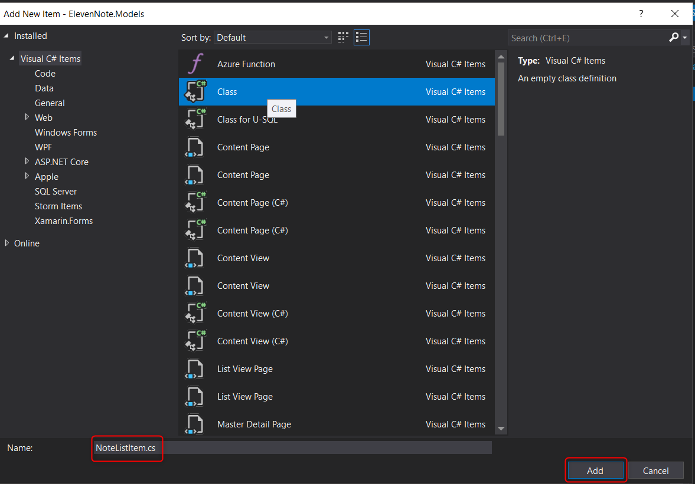

# 4.1: `NoteListItem` MODEL
---
In this module we'll make our first model in our models assembly.

<hr />

### Creating Models
We'll be using models throughout our application for scaffolding code, creating objects properly at the right time and in the right way, and matching objects that are passed in from the view to properly reflect what they should be shaped like in the database. 

### Create the `NoteListItem` Model
The first model we will create will handle the task of collecting property data for a list of notes. When a user enters information, we will want them to enter specific data. When we show information, we will want to show specific data in specific views. 

### Steps
1. In the **Solution Explorer**, right click on **ElevenNote.Models**
2. Select **Add -> Class** and name it `NoteListItem.cs`
 
3. Make the class public immediately.
4. Add the following properties. (Note: for the `ToString` method, you can type `override` and then a space):

```cs
namespace ElevenNote.Models
{
    public class NoteListItem
    {
        public int NoteId { get; set; }
        public string Title { get; set; }

        public DateTimeOffset CreatedUtc { get; set; }

        public override string ToString()
        {
            return base.ToString();
        }
    }
}
```
5. These are the properties that will show up in the view. You can add data annotations to these properties.  For example, to change the display name of `CreatedUtc`:

```cs
    [Display(Name="Created")]
    public DateTimeOffset CreatedUtc { get; set }
```
6. `CTRL .` to bring in the using statement for the `[Display]` annotation.
7. Move on to the next module and we'll build out the view using the model details.