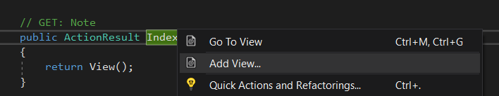
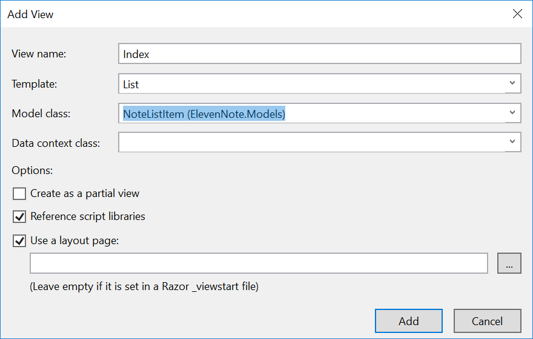
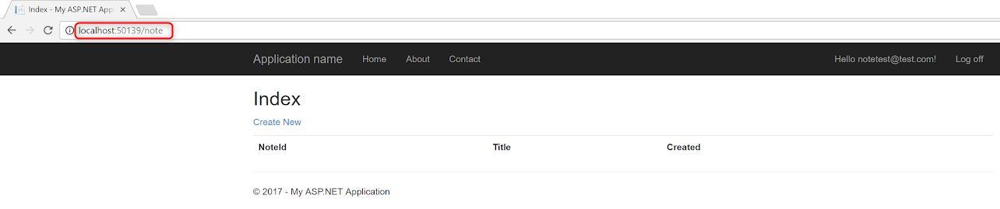

# 4.2: INDEX VIEW
---
In this module we'll refactor the Index View for the Index() controller method.

<hr />

### Create the Index View
1. In **ElevenNote.Web -> Controllers** folder, open the **Note Controller**
2. Right click on the `Index()` method.
3. Select **Add View** 

4. Fill it out like this:


#### Notes
- This creates a file in the views folder, but we won't see anything if we run the app since there is no data yet. 
- The view created is based on the properties listed in the `NoteListItem.cs` model. If those change, you'll want to re-do this. 
- We'll look at the view file later.

### Implement `NoteListItem` model
1. Back in the **Note Controller**, add this code in the `Index()` method:

```cs
namespace ElevenNote.Web.Controllers
{
    public class NoteController : Controller
    {
        public ActionResult Index()
        {
            var model = new NoteListItem[0];
            return View(model);
        }
    }
}
```
Note: In the code above, we are initializing a new instance of the NoteListItem as an IEnumerable with the [0] syntax. This will satisfy some of the requirements for our Index View. When we added the List template for our view, it created some IEnumerable requirements for our list view. More on that later. 

2. Press `CTRL .` to bring in the using statement for the `NoteListItem` model.
3. One very nice attribute in C# is the `[Authorize]` annotation. This annotation makes it so that the views are accessible only to logged in users:
```cs
namespace ElevenNote.Web.Controllers
{
    [Authorize]
    public class NoteController : Controller
```
4. 
5. Run the app
6. Add `/Note/Index` or `/Note` to the end of the URL

7. If you are not logged in, you should be redirected to the Login page. This is due to the `[Authorize]` annotation we added.
8. If you are logged in, you should be directed to the List view. 
