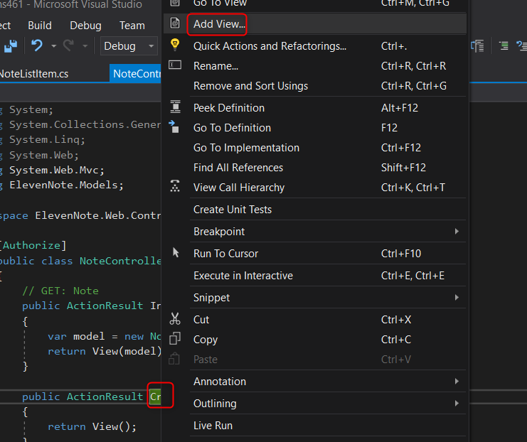
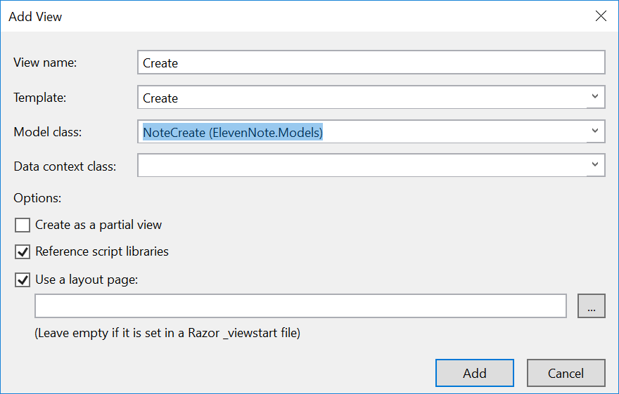

# 5.2: CREATE VIEW
---
In this module we will add a view for creating a note.

### Steps
1. In the **ElevenNote.Web -> Controllers** folder, open the `NoteController.cs` file.
2. Right click on the `Create()` method
3. Select **Add View**.

4. Fill it out like this:

5. This will create a `Create.cshtml` file in the `Notes` directory.
6. Run the app.
7. Append /Note/Create to the end of your url. You should see the Create view.

[Next,](5.3-ChangeNoteCreate.md) we'll make a small change to the `NoteCreate` and `NoteListItem` models.