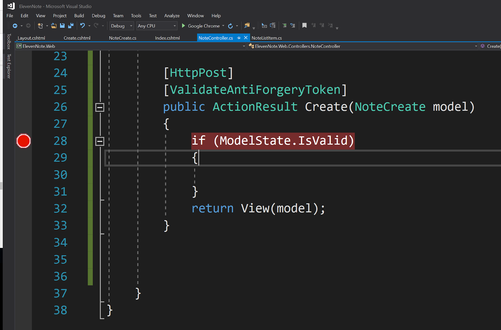
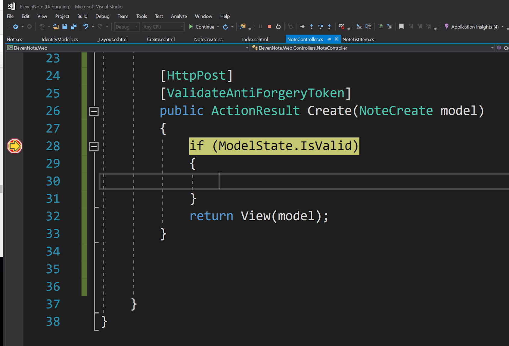
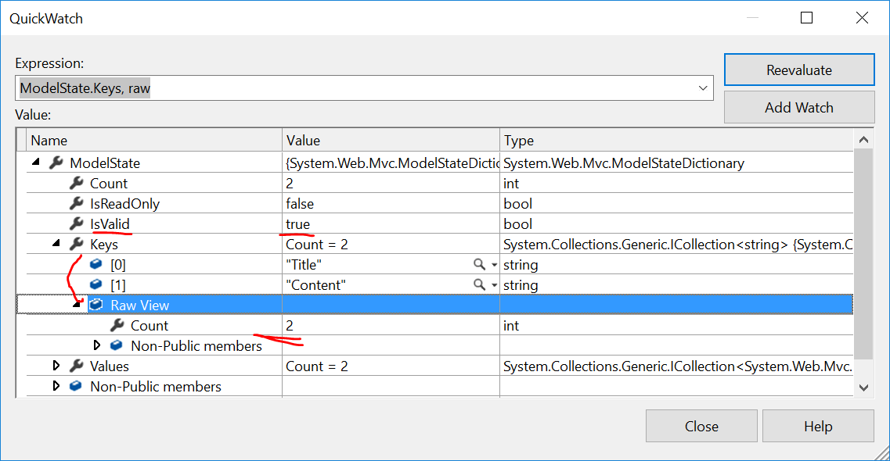

# 5.4: CREATE `[HttpPost]` METHOD
---

In this section, we write an `[HttpPost]` method that will eventually push the data inputted in the view through our service and into the database.

<hr />

### Steps
1. Go to **ElevenNote.Web -> Controllers -> NoteController.cs**
2. Add the following code under the existing `Create()` method:
    ```cs
            public ActionResult Create()
            {
                return View();
            }
            
            //Add code here vvvv
            [HttpPost]
            [ValidateAntiForgeryToken]
            public ActionResult Create(NoteCreate model)
            {
                if (ModelState.IsValid)
                {

                }
                return View(model);
            }
        }
    }
    ```
3. 

### QuickWatch and Data
1. Set a breakpoint at the spot noted in the image below:

2. Run the app and login.
3. Go to the localhost:xxxxx/Note/Create route.
4. Create a note
5. You should hit the breakpoint and it should turn yellow:

6. Right click on `ModelState` and click **QuickWatch**

7. Slowly walkthrough the app and hover over the various points where the app is broken. 
8. With Breakpoints and Quickwatch, You can explore the data coming from the view, and the best .NET developers use these tools often.

### Persist a Note
When we save something to the database, we persist it. 
1. Remove the breakpoint and rerun the app. 
2. Create a note. When you hit submit, the page won't change. 
3. Go to **SQL Server Object Explorer**.
4. Find the database and expand the tables.
5. Right click on `dbo.Note` and click **View Data**.
6. The data is not going into the database, we'll take care of that in the next chapter by bringing in our ElevenNote.Service.
