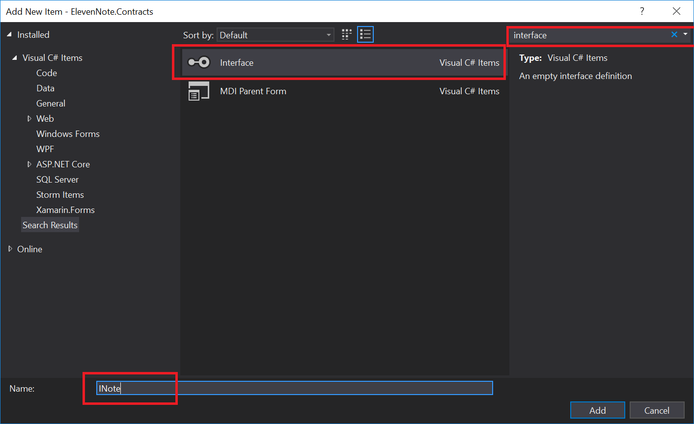

# INote.cs
---
In this module we'll create the INote interface.

<hr />

### Purpose
Our interface allows us to define method signatures that we began to design in the previous module. When we implement the interface on a class, we have to provide an implementation for each of the functions found in the interface. 

### Steps
1. Right click on the `ElevenNote.Contracts` assembly.
2. Choose Add, new item.
3. Do a search for interface. 
4. Call it `INote.cs`.
5. See the image for details:


### Adding Methods
Once you have the interface file open, do the following:
1. Make the interface public.
2. Add method signatures for all of the methods we discussed in the last module. Your file will have the following code, and you will have errors as you type it:

```cs
using ElevenNote.Models;
using System;
using System.Collections.Generic;
using System.Linq;
using System.Text;
using System.Threading.Tasks;

namespace ElevenNote.Contracts
{
    public interface INote
    {
        IEnumerable<NoteListItem> GetNotes();
        bool CreateNote(NoteCreate model);
        NoteDetail GetNoteById(int noteId);
        bool UpdateNote(NoteEdit model);
        bool DeleteNote(int noteId);
    }
}
```

3. Here is what you will see with the errors:

4. We're adding these so that we can show the idea of coding with intent. We're going to use the model name errors to quickly create our files. Click on the `NoteListItem` parameter in `GetNotes` method.
5. Press `ctrl .`.
6. Choose generate class.
7. You should see the `NoteListItem` pop up in the `.Contracts` assembly. 

8. Let's move that file down to the `.Models` assembly.
9. You'll need to change the assembly name, too.
10. Here's what you should see:


<hr />

### Rinse and Repeat
You'll need to repeat these steps for the `NoteEdit` & `NoteDetail` classes. This has about as many steps as the route of right clicking on the assembly. Just a slightly different way for creating the files. You can speed this process up by cutting the generated class file and then pasting in the .Models assembly.

In the end it should look like this for you:
