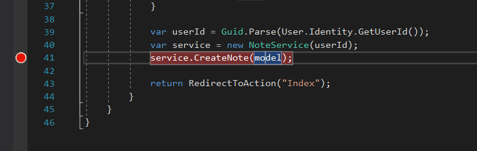
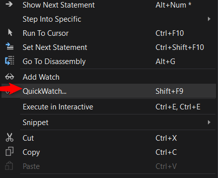
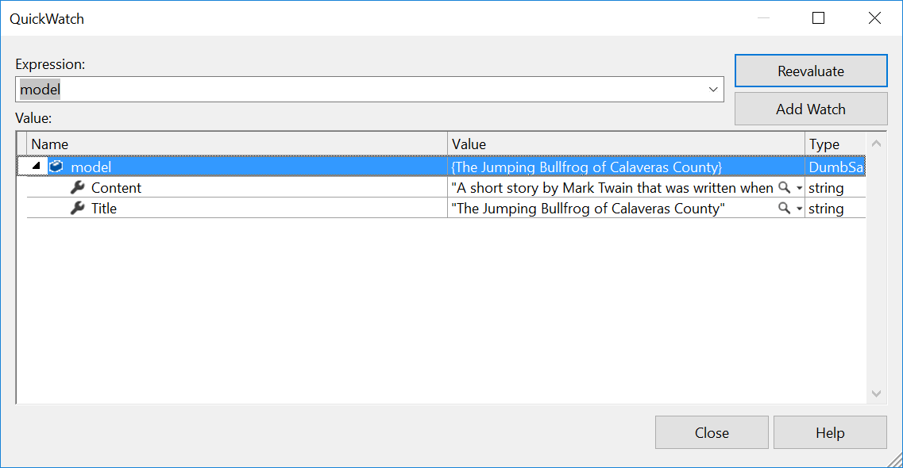
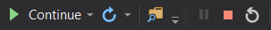
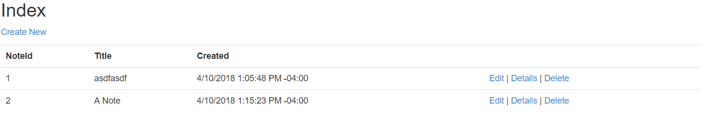
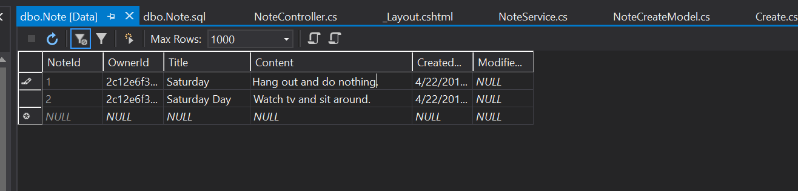
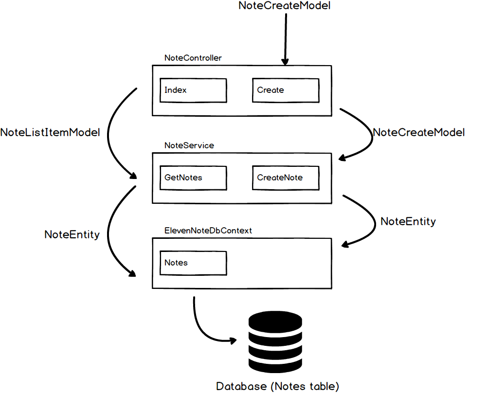

# 6.2: QUICKWATCH & DATA
---
### Set Breakpoints & QuickWatch
In this module, we will use **breakpoints and QuickWatch** to see the flow of our data.

1. Set a breakpoint:

2. Run the app, login, and create a note
3. Right click on the word `(model)` within `service.CreateNote(model)` and choose QuickWatch

  

  
4. You should see your data in the QuickWatch window

5. Click the Green continue arrow to go past the breakpoint. You should now see your note appear!

6. Stop the app

### Data
1. Go the the **SQL Server Object Explorer**
2. Find the database and expand the tables
3. Right click on `dbo.Note` and click **View Data**
4. You should see the note(s) you've created in the database

5. 
6. Diagram of how the models work with the service methods:

[Next,](../7-CreateRefactor/7.0-CreateRefactor.md) we'll refactor some things for creating a note.