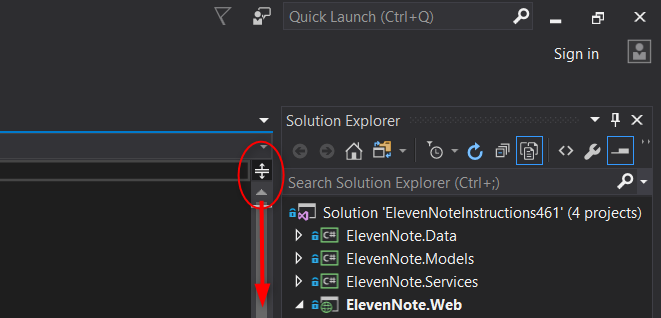
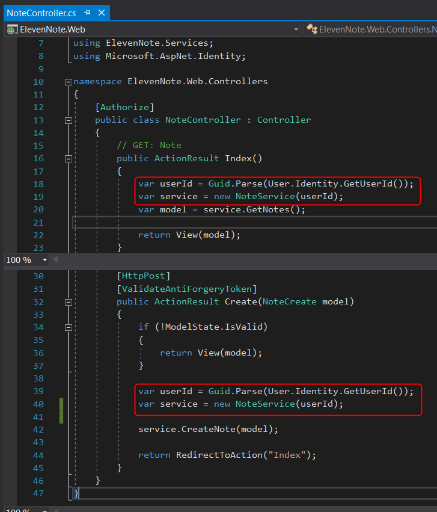
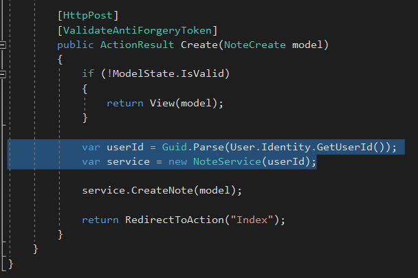
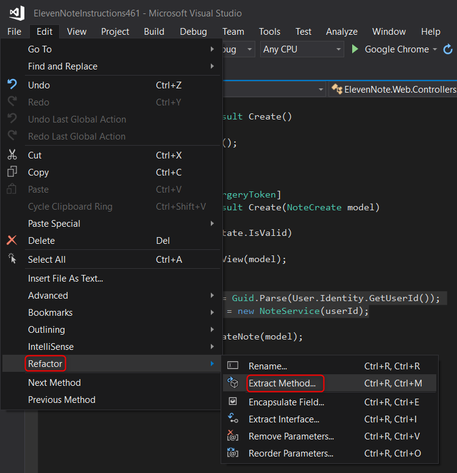
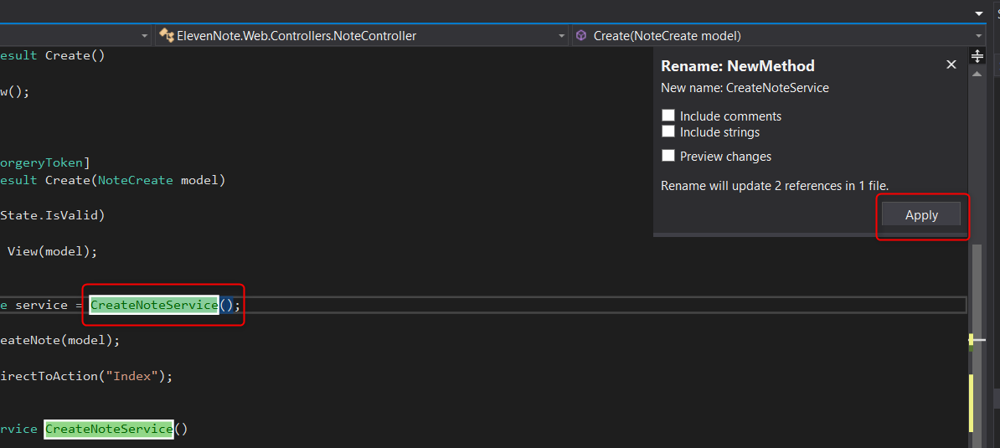
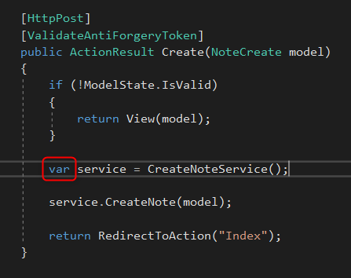

# PART 7: CREATE REFACTOR
---
### Refactor `CreateNoteService`
1. Open **ElevenNote.Web -> Controllers -> NoteController**
2. Click and drag down the button at the top right corner of the window so it splits the code into 2 sections.  This is so you can see things at the top and bottom of the file at the same time.

3. Notice that the same 2 lines are repeated
<!-- TODO - is this right? -->

4. Select this code in the `Create` method

5. Go to **Edit -> Refactor -> Extract Method**

6. Rename the new helper method `CreateNoteService()`

7. Change `NoteService` to `var`

8. Notice how it abstracts out the code so that it is usable in all `ActionResult` methods
9. **TIP:** *Do not try to instantiate a `Service` inside of the constructor. The MVC framework does not have the data available that may be needed.*

[Next,](7.1-ValidationMessages.md) we'll add some validation messages. 
