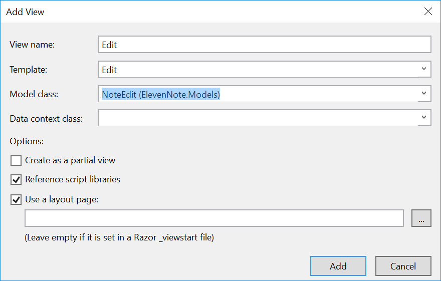
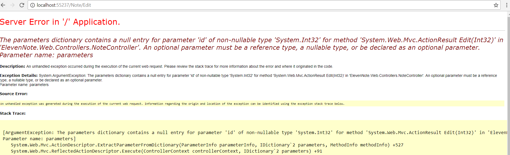
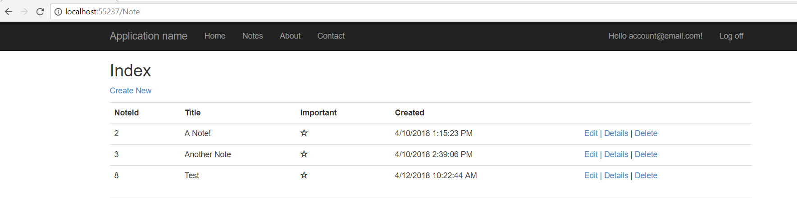

# 9.1: EDIT VIEW
---
### Create the `Edit` View
Now we create the physical view for the `NoteEdit` model.

1. Still in the `NoteController.cs` file, right click on the `Edit(int id)` method
2. Add a view as below:


### `Edit` Post Method
1. Back in `NoteController.cs`, build an overloaded `Edit` ActionResult under the `Edit(int id)` method:

    ```cs
    [HttpPost]
    [ValidateAntiForgeryToken]
    public ActionResult Edit(int id, NoteEdit model)
    {
        return View();
    }
    ```
2. Add some validation similar to the `ActionResult Create` to make sure the `NoteId` matches:

    ```cs
    [HttpPost]
    [ValidateAntiForgeryToken]
    public ActionResult Edit(int id, NoteEdit model)
    {
        if(!ModelState.IsValid) return View(model);

        if(model.NoteId != id)
        {
            ModelState.AddModelError("", "Id Mismatch");
            return View(model);
        }

        return View();
    }
    ``` 
3. Continue to build out the method, displaying a message to the user with the result of their actions:

    ```cs
    [HttpPost]
    [ValidateAntiForgeryToken]
    public ActionResult Edit(int id, NoteEdit model)
    {
        if(!ModelState.IsValid) return View(model);

        if(model.NoteId != id)
        {
            ModelState.AddModelError("", "Id Mismatch");
            return View(model);
        }

        var service = CreateNoteService();

        if (service.UpdateNote(model))
        {
            TempData["SaveResult"] = "Your note was updated.";
            return RedirectToAction("Index");
        }

        ModelState.AddModelError("", "Your note could not be updated.");
        return View(model);
    }
    ```

### Remove `NoteId` from the Edit View
1. Go to **ElevenNote.Web -> Views -> Note -> Edit.cshtml**
2. Delete lines 18-24, we don't need to see the `NoteId`, and it should not be editable.
3. We will add a reference to this code, but make it hidden.
4. Add this line of code *(starting with `@Html.HiddenFor...`)* in place of the lines we deleted:

    ```html
    @HtmlValidationSummary(true, "", new { @class = "text-danger" })
    @Html.HiddenFor(model => model.NoteId)

    <div class="form-group">

    ```
5. Run the app and make sure you can edit a note, if so, 
6. If you run from the `Edit.cshtml` file, you will get an error because the URL goes to */Note/Edit* but not to a specific note id.

7. Change the URL to remove */Edit* to get to the index view which lists all the notes.


[Next,](../10-NoteDelete/10.0-NoteDelete.md) we'll add the ability to delete a note.
  